# 
Solver Benchmark Report

## exponential

- Best L2 error: 0.00e+00
- Speedup: 5.12x

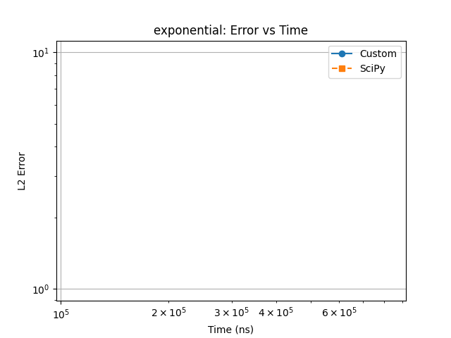

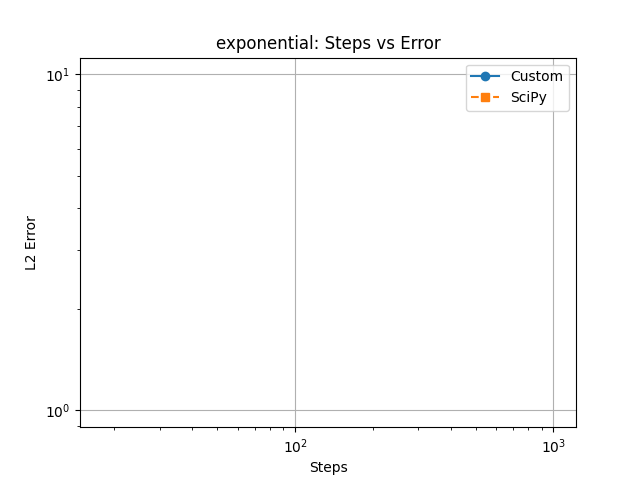

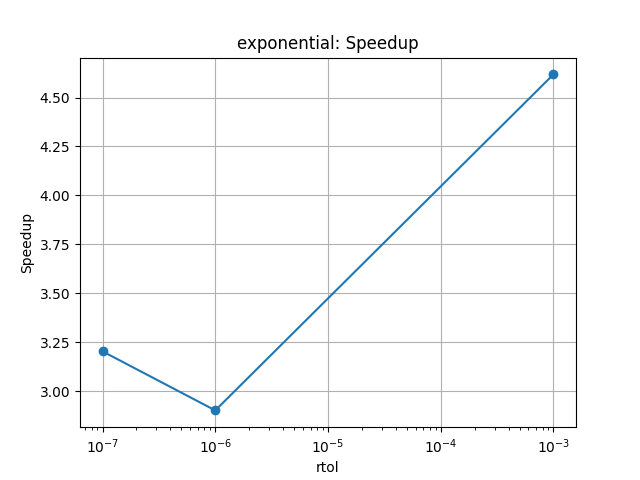

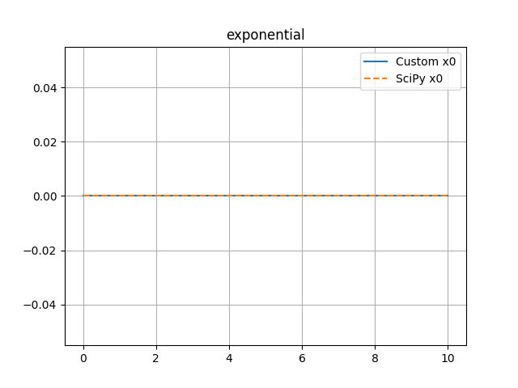

## harmonic

- Best L2 error: 1.92e-05
- Speedup: 17.51x

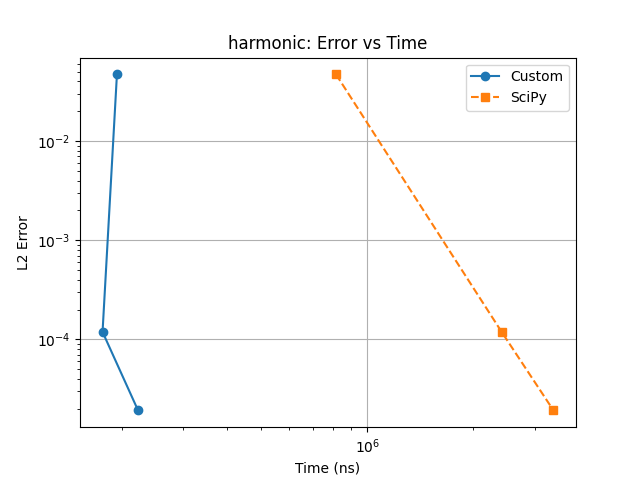

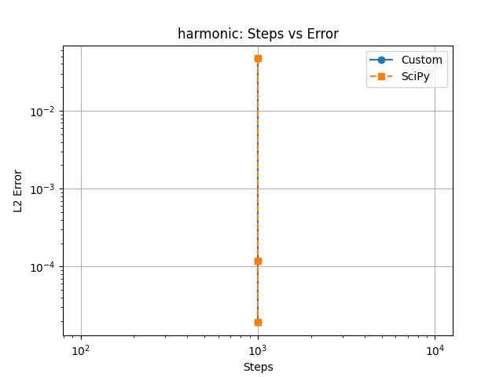

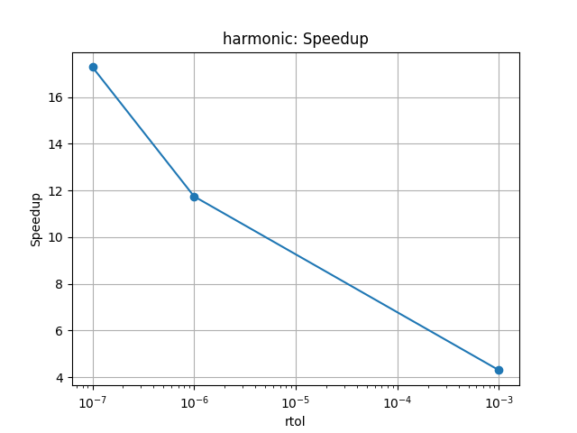

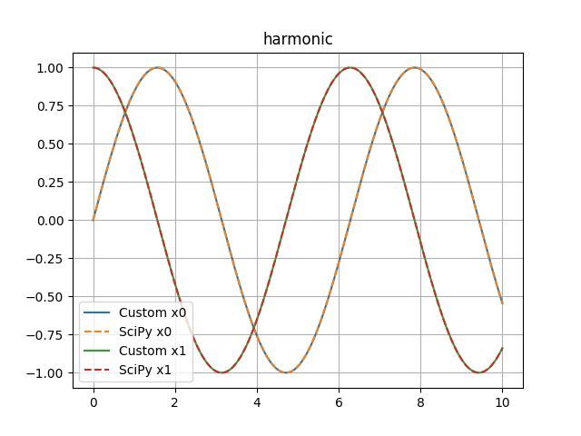

## damped harmonic

- Best L2 error: 1.52e-05
- Speedup: 17.62x

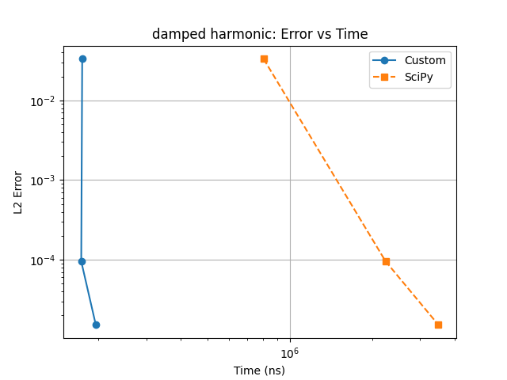

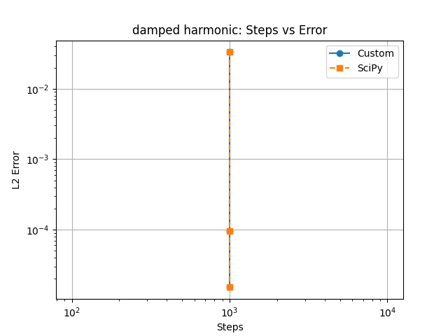

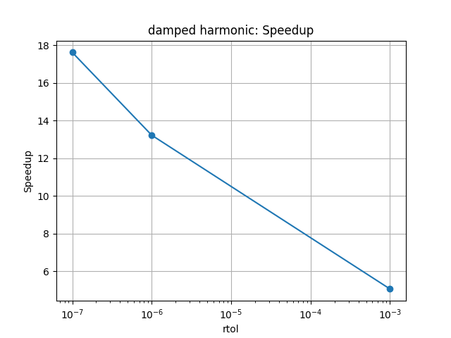

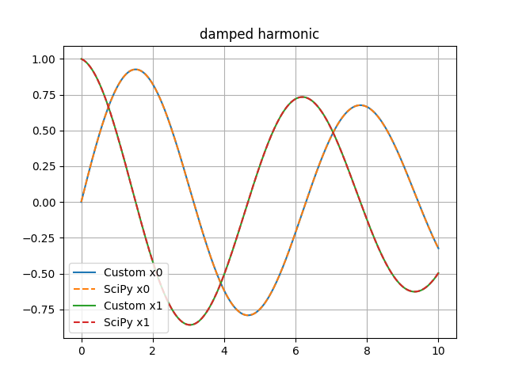

## forced

- Best L2 error: 5.65e-05
- Speedup: 18.71x

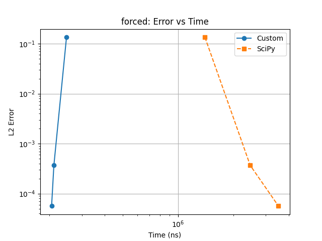

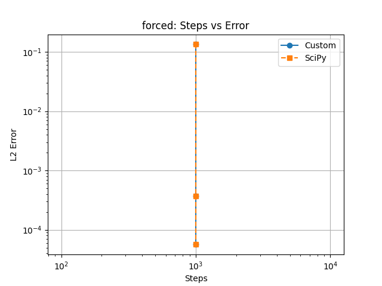

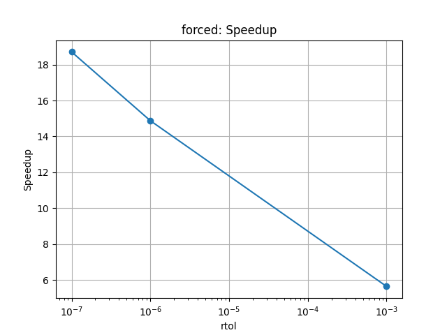

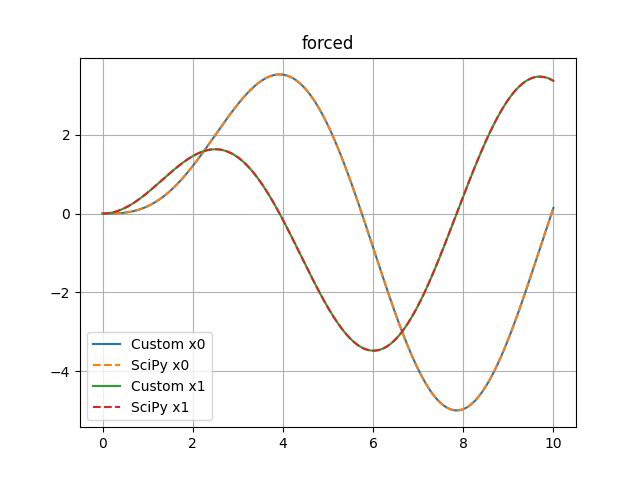

## logistic

- Best L2 error: 3.13e-08
- Speedup: 2.04x

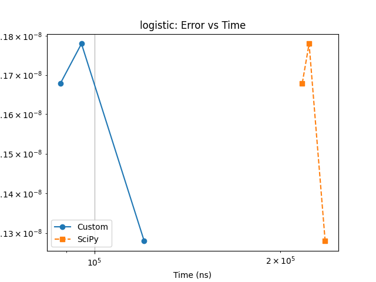

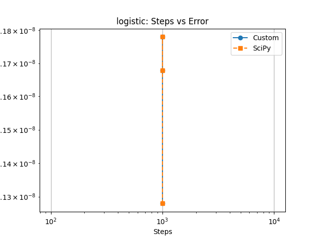

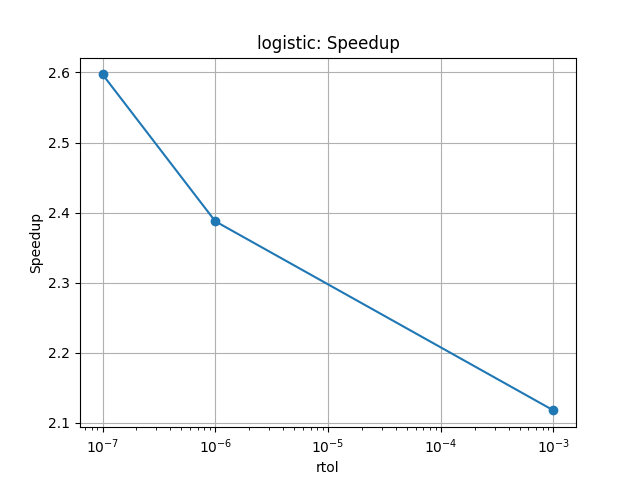

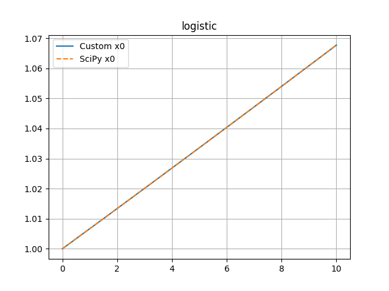

## van der pol

- Best L2 error: 1.42e-04
- Speedup: 15.97x

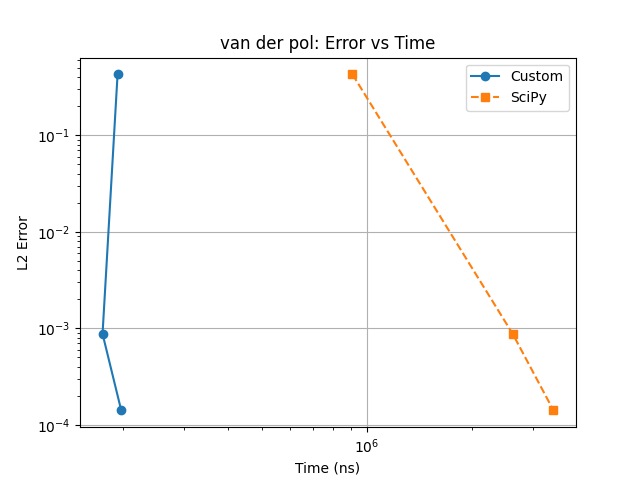

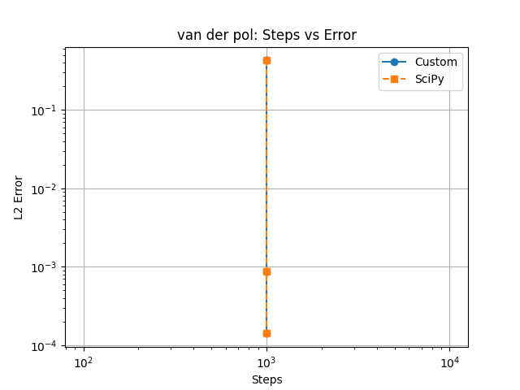

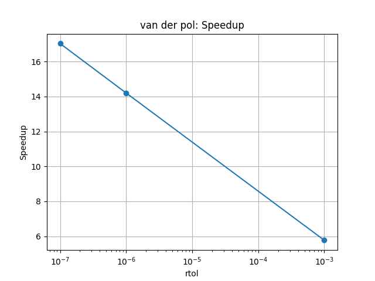

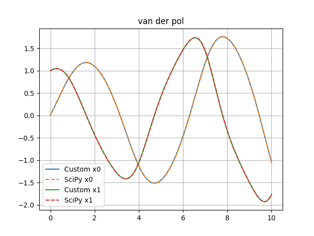

